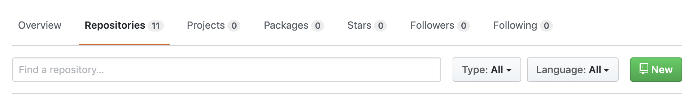
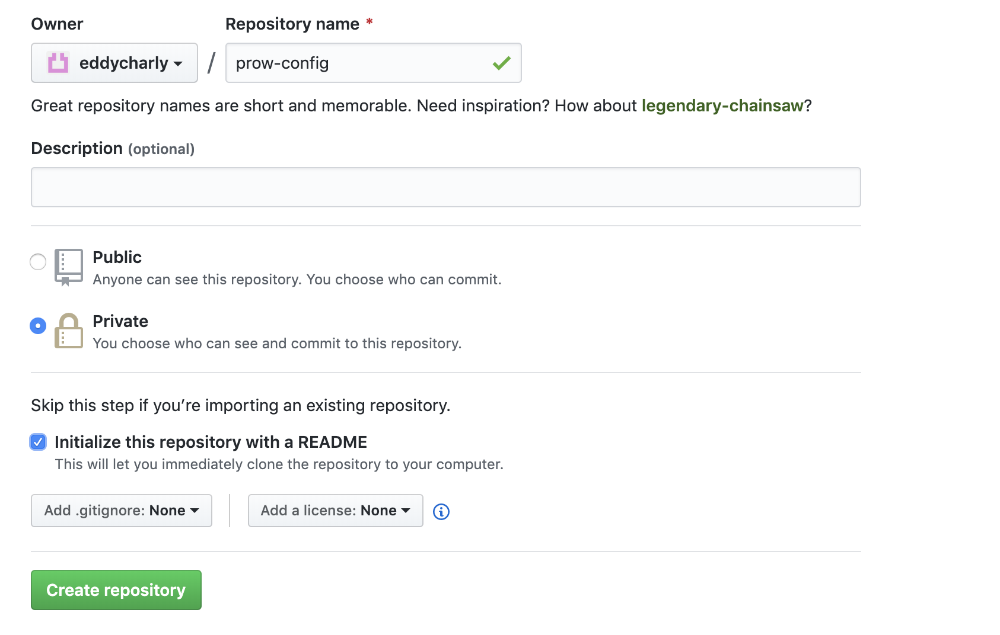
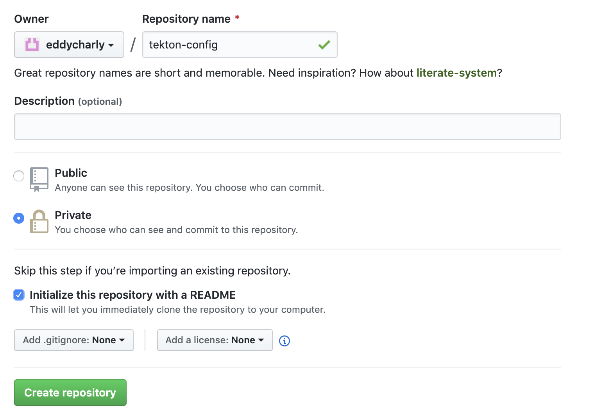
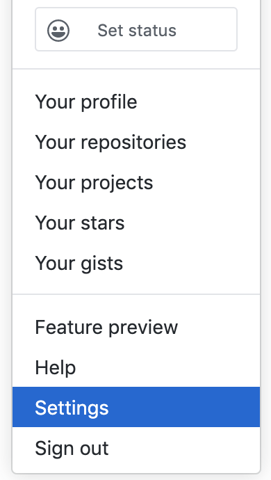
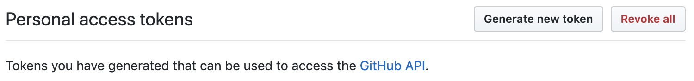
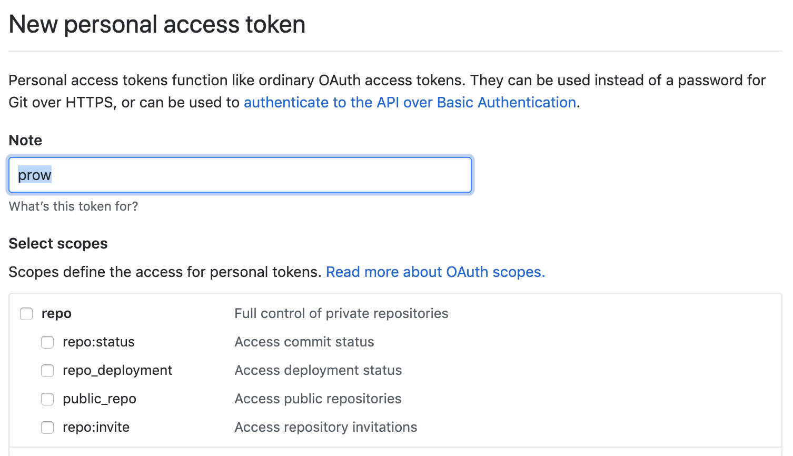
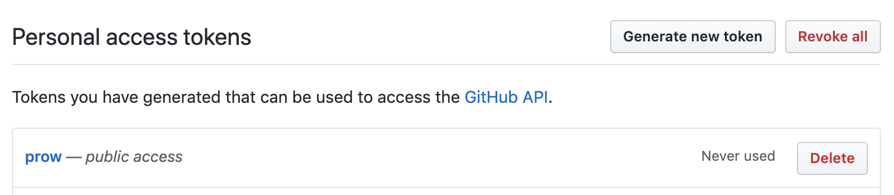

# helm-prow-tekton

This repository contains the necessary helm charts to bootstrap a [prow](https://github.com/kubernetes/test-infra/tree/master/prow) + [tektoncd](https://github.com/tektoncd) stack in a kubernetes cluster.
This is the stack we use at [www.agriconomie.com](www.agriconomie.com) to build our ci/cd pipelines.

It also contains a step by step guide to setup andd configure the whole stack in such a way that the prow configuration and tekton pipelines are automatically kept in sync with a github repository.

## Prerequisites

To install the stack you will need the following

- A kubernetes cluster of any kind (EKS, kops, bare metal...)
- A github account
- helm and kubectl installed and configured

## How it works

1. You create a github repository to manage prow config files (config.yaml, plugins.yaml and job-config/*.yaml)
2. You create a github repository to manage the tekton pipelines (tasks/*.yaml, pipelines/*.yaml)
3. You create the necessary secrets for running prow
4. You deploy prow in the kubernetes cluster using helm
5. You deploy tekton in the kubernetes cluster using helm
6. You configure the _config-updater_ plugin to keep prow configuration in sync with the repository created in 1
7. You setup a tekton pipeline and a prow job to keep the tekton resource in sync with the repository created in 2

All this is explained in the following section

## Step by step deployment and configuration guide

### Create a github repository to manage prow config files

In your github account, create a repository for storing your prow configuration files.



Click the _New_ button.



Pick a name, create it either public or private, and hit the _Create repository_ button.

I called mine _prow-config_ but you can choose any name you want.

### Create a github repository to manage prow pipelines and tasks

In your github account, create a repository for storing your tekton tasks and pipelines.


Click the _New_ button.



Pick a name, create it either public or private, and hit the _Create repository_ button.

I called mine _tekton-config_ but you can choose any name you want.

### Create the secrets need for prow

Before deploying prow, you need to create configure some access informations for prow to be allowed to connect to your github account.

First, create a github account, then create an oauth token for it.
Do not use your own github account as prow will ignore things done by itself, if you use your own account, chances are that it will ignore eveything you do.



In the new github account profile click on the _Settings_ item.



Then click on the _Generate new token_ button.



Fill in the form and click on the _Generate_ button.



Note the token somewhere, you will need it later.

In order to use github webhooks you will need to create another secret.

Run the command `openssl rand -hex 32` and note the result, you will need it later.

You will also need to create a secret to be used as a deck cookie.

Run the command `openssl rand -base64 32` and note the result, you will need it later.

### Deploy prow using helm

This repository contains a helm chart to easily deploy prow.

You will have to clone this repository as the helm chart is not distributed over a helm repository (yet).

Once the repository is cloned, run the following command :

```bash
helm upgrade --install prow --namespace prow ./helm/prow \
    --set-file config=./helm/prow/config/config.yaml \
    --set-file plugins=./helm/prow/config/plugins.yaml \
    --set deck.cookieSecret=your_cookie_secret \
    --set github.hmacToken=your_github_secret \
    --set github.oauthToken=your_github_token
```

You will have to replace `your_cookie_secret`, `your_github_secret` and `your_github_token` with the secrets you created at the previous step.

This will deploy prow in the prow kubernetes namespace with default configuration.

See ./helm/prow/readme.md for the list of what can be customized in the chart.

### Deploy tekton using helm

This repository contains a helm chart to easily deploy tekton.

You will have to clone this repository as the helm chart is not distributed over a helm repository (yet).

Once the repository is cloned, run the following command :

`helm upgrade --install tekton --namespace tekton ./helm/tekton`

This will deploy tekton in the tekton kubernetes namespace with default configuration.

See ./helm/tekton/readme.md for the list of what can be customized in the chart.

### Configure the config-updater plugin to keep prow configuration in sync

TODO

### Setup a tekton pipeline and a prow job to keep the tekton resource in sync

TODO
